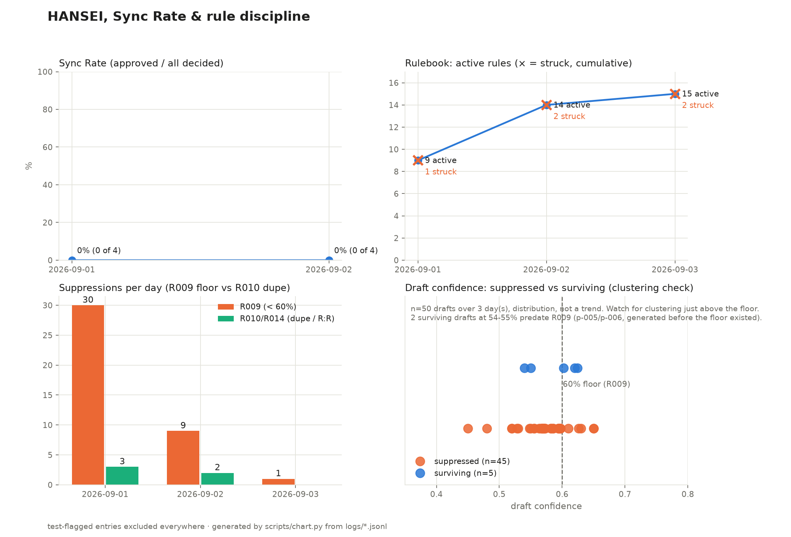

# HANSEI

反省 — the practice of reflecting on what you did wrong, even when you succeeded.

HANSEI is an AI trading analyst on Binance Agent OS that **proposes** trades,
learns from every rejection, and publishes an honest report card every night.
It cannot execute anything on its own — the human (the Pilot) approves or
rejects every proposal, and Binance requires its own confirmation on top.

**Sync Rate** — approved proposals / all decided proposals — is the headline
metric. It starts at 0% (0 of 1) and every point carries its denominator,
because a rate without its n is how small experiments lie.

## Confirm-before-execute is the design, not a limitation

The agent (the Unit) drafts a decision packet: thesis, evidence with cited
numbers, confidence, invalidation, size reasoning, and every rulebook check.
Two human gates stand between that packet and a fill: the Pilot's y/n in the
terminal, and Binance's own order confirmation, enforced by the platform.
HANSEI is built WITH that constraint: the product is the quality of the
proposals and the learning loop on rejections — captured as reason codes
(SIZE / TIMING / CONVICTION / RISK / DUPLICATE / ASSET / OTHER), reviewed in
a nightly Debrief, and compiled into a growing [rulebook](rulebook.md) where
struck rules stay visible forever.

## The measured finding: on-chain signal feeds are dry for a CEX spot account

We harvested **3,097 signals** from the Binance Web3 smart-money and
market-rank feeds over their full recoverable window. After two ingest rules,
**0 were eligible** — zero, every day:

- **R005**: an asset must exist as an active Binance spot USDT pair.
  60 of 62 live signals failed this on day one (microcap launchpad tokens,
  non-ASCII tickers, one pair halted in BREAK status).
- **R006**: a ticker match is not an identity match — the signal's contract
  address must equal the canonical Binance-Peg/issuer contract, fail-closed.
  This caught a 120-USDT-liquidity token impersonating WINkLink that R005
  alone would have admitted as "WIN".

Zero eligible is the *correct* answer, not a failure: the on-chain meme
universe and a spot-only CEX account barely overlap, and rules that admit
nothing beat rules that admit an impersonator. Every discarded signal is
retained in `logs/signals_discarded.jsonl` with its reason.

The signal layer therefore reads the venue we actually trade: cross-sectional
(all-pairs ticker), time series (klines), and order book (depth) — three
structurally independent sources, and a packet must cite at least two (R007,
enforced in code, not in a prompt).

## The gates, measured (scan 3, first funded scan)

23 USDT pairs above the volume floor, 8 scanned deep, **6 packet-worthy
candidates** — of which **4 were suppressed by R009** (confidence below 60%
becomes NO_PROPOSAL, logged so confidence clustering just above the floor is
visible), **1 suppressed by R010** (a packet for that symbol was already
awaiting a verdict), and **1 became a packet**. The funnel narrows on
purpose; every narrowing is logged.

## Honesty line

Market scanning reads public api.binance.com endpoints directly for
payload-size reasons (the full-ticker response is 1.5MB and a scan is ~30
calls); all authenticated actions — account state, order validation, order
placement — go through the Binance MCP server.

## Bugs found and reported along the way

- [Windows CLI break in the binance-web3 skill CLIs](docs/bug-report-windows-cli.md)
  — `import.meta.url` vs `process.argv[1]` never match on Windows; exit 0, no output.
- [analysis_getTokenAiReport returns an empty success envelope](docs/bug-report-token-ai-report.md)
  — no report object for BNB, XRP, or BTC, the tool's own documented example.
- [spot_getAccount serves a stale snapshot after a confirmed deposit](docs/bug-report-stale-getaccount.md)
  — an agent trusting it alone sizes trades against phantom capital; our
  balance layer refuses to size a trade when no source is trustworthy.

## What we claim, and what we don't

We do not claim profitability. A few days of a 40 USDT demo account proves
nothing about returns, and public experiments show LLM traders mostly lose.
The claim is **behaviour change, measured**: Sync Rate rising, repeated
mistakes stopping, rule compliance holding at 100%, fee drag falling — every
number derived from append-only logs (`logs/`), packets preserved verbatim
(`packets/`), and a nightly self-review that must name a real mistake
(`debriefs/`). The first Debrief's headline mistake: the Unit generated two
coin-flip packets hours after its own test run called that exact behaviour
out — which is why the 60% floor is now a rule it cannot skip.
